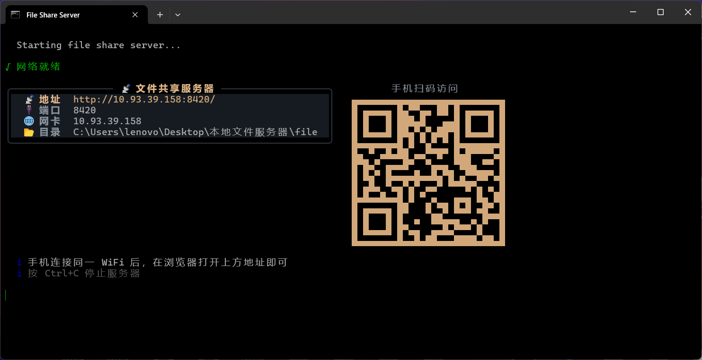
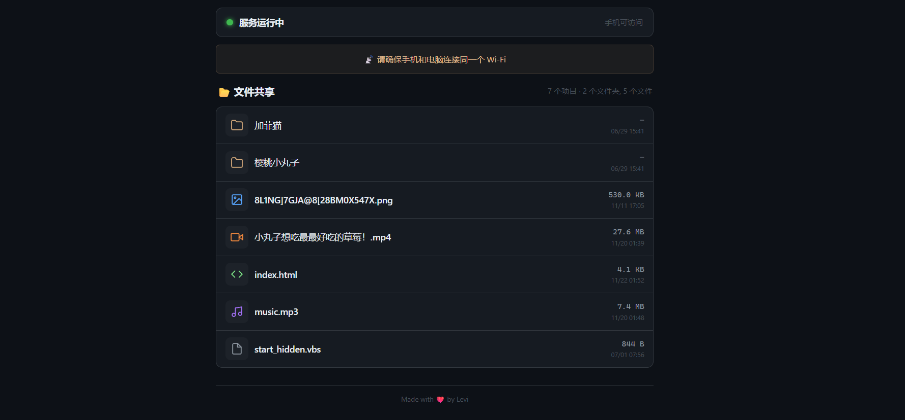

<p align="center">
  
</p>

<h1 align="center">文件共享服务器</h1>
<p align="center">File Share Server — 局域网内所有人上传、下载、看实时速度</p>

<p align="center">
  = 14">
  
  
</p>

---

## ✨ 功能

- ⬆️ **网页上传** — 拖拽或选择多个文件，逐个显示进度、速度、剩余时间
- ⬇️ **网页下载** — 自动生成带图标的文件列表，手机点一下即可下载
- 📊 **实时速度** — 页面顶部显示**整个服务器**（所有用户合计）的上传/下载速度与活动传输数，附 60 秒双向流量曲线
- 📂 **目录浏览** — 支持多级子目录，上传默认落在当前浏览的目录
- 📱 **手机扫码访问** — 终端自动打印二维码，扫一扫就能用
- 🎬 **视频在线播放** — 支持 HTTP Range，拖拽进度条任意跳转
- 💾 **流式读写** — 上传下载全程走 stream，传 10GB 文件内存也不涨
- 🔒 **路径安全** — 严格限制在共享目录内，不会覆盖同名文件，不会写到目录外
- 📦 **零配置启动** — 一条命令跑起来，无数据库、无前端框架、无构建步骤

## 📸 预览

### 终端启动画面


### Web 界面



> 截图取自旧版界面，尚未包含上传区域与实时速度面板。

## 🚀 快速开始

### 前提条件

- [Node.js](https://nodejs.org/) >= 14

### 安装 & 启动

```bash
# 1. 克隆仓库
git clone https://github.com/2060861791/文件共享服务器.git
cd 文件共享服务器

# 2. 安装依赖
npm install

# 3. 配置共享目录（复制配置示例并修改 SHARE_DIR）
cp .env.example .env
vi .env

# 4. 启动服务器
node index.js
# 或者
npm start
```

启动后，终端会显示服务器地址和二维码。手机连接同一 Wi-Fi，扫描二维码即可访问。

### Windows 双击启动

双击 `start.cmd`，自动检查环境并启动服务器。

### 开机自启（Windows）

1. 找到项目的 `start_hidden.vbs`
2. `Win + R` → 输入 `shell:startup` → 回车
3. 右键 → 新建快捷方式 → 指向 `start_hidden.vbs`
4. 下次开机自动后台启动，零窗口零打扰

或直接在 PowerShell 中运行：

```powershell
$WshShell = New-Object -ComObject WScript.Shell
$Shortcut = $WshShell.CreateShortcut(
  [Environment]::GetFolderPath('Startup') + '\文件共享服务器.lnk'
)
$Shortcut.TargetPath = 'C:\你的路径\start_hidden.vbs'
$Shortcut.WorkingDirectory = 'C:\你的路径'
$Shortcut.Save()
```

取消自启：删除 `shell:startup` 中的 `文件共享服务器.lnk` 即可。

## 💾 数据与代码分离

共享文件**不再放在项目目录里**，而是独立存放：

```
项目（可以随便 git pull）        数据（更新代码不受影响）
/home/levi/file-share-server/    /srv/file-share/files/
├── index.js                     ├── test.zip
├── .env                         ├── movies/
└── package.json                 │   └── movie.mp4
                                 └── 加菲猫/
```

启动时如果共享目录不存在会自动创建。可以用环境变量或 `.env` 覆盖路径：

```bash
# Linux
SHARE_DIR=/srv/file-share/files node index.js

# Windows
set SHARE_DIR=D:\file-share\files && node index.js
```

> **从旧版本升级？** 以前文件放在项目的 `file/` 目录。把里面的内容移动到新的共享目录即可，
> 例如 Linux 上：`sudo mv file/* /srv/file-share/files/`。移动后建议删掉旧的 `file/` 目录，
> 避免以后误以为它还在生效。

## ⚙️ 配置

复制 `.env.example` 为 `.env` 后修改（系统环境变量优先级更高）：

```ini
# Linux
SHARE_DIR=/srv/file-share/files

# Windows（推荐正斜杠，或写成双反斜杠）
# SHARE_DIR=D:/file-share/files
# SHARE_DIR=D:\\file-share\\files

PORT=8420
MAX_UPLOAD_BYTES=0
```

| 环境变量 | 默认值 | 说明 |
|----------|--------|------|
| `SHARE_DIR` | `/srv/file-share/files` | 共享目录（用户上传的文件都放这里） |
| `PORT` | `8420` | 服务器端口 |
| `MAX_UPLOAD_BYTES` | `0` | 单文件上传上限（字节），`0` = 不限制 |

## 🔌 HTTP API

| 方法 | 路径 | 说明 |
|------|------|------|
| `GET` | `/` | 目录列表页面（HTML，含上传区与实时速度） |
| `GET` | `/<目录>/` | 子目录列表，上传会落在该目录 |
| `GET` | `/<文件>` | 下载文件，支持 `Range` 断点续传 |
| `GET` | `/api/stats` | 实时速度 JSON |
| `POST` | `/api/upload?dir=<相对路径>` | 上传文件（`multipart/form-data`） |

### `GET /api/stats`

```json
{
  "uploadSpeed": 1048576,
  "downloadSpeed": 5242880,
  "activeUploads": 2,
  "activeDownloads": 3
}
```

- 速度单位是 **字节/秒**，统计的是**整个服务器所有客户端**的合计速度，不是单个浏览器。
- 每秒采样一次：`(当前累计字节 - 上一次累计字节) / 经过的秒数`。
- 下载速度按**实际经过 HTTP 响应**的字节统计，而不是磁盘读取量。

### `POST /api/upload`

- `Content-Type: multipart/form-data`
- 目标目录用查询参数 `?dir=` 指定（相对共享根目录，留空 = 根目录）
- 支持一次提交多个文件（多个同名 `file` 字段）
- 请求体直接流式写入磁盘，**不会把整个文件读进内存**
- 同名文件不会被覆盖，自动改名为 `test (1).zip`、`test (2).zip` …

响应：

```json
{
  "ok": true,
  "dir": "movies",
  "files": [
    { "ok": true,  "name": "test.zip", "savedAs": "test (1).zip", "size": 10485760, "error": null },
    { "ok": false, "name": "big.iso",  "savedAs": "big.iso",      "size": 8123,     "error": "客户端中断" }
  ]
}
```

## 🧪 测试

### 测试上传

```bash
# 单文件，上传到根目录
curl -F "file=@test.zip" http://127.0.0.1:8420/api/upload

# 上传到子目录 movies/
curl -F "file=@movie.mp4" "http://127.0.0.1:8420/api/upload?dir=movies"

# 一次上传多个文件
curl -F "file=@a.txt" -F "file=@b.txt" http://127.0.0.1:8420/api/upload

# 同名文件不会被覆盖（连传两次，第二次变成 test (1).zip）
curl -F "file=@test.zip" http://127.0.0.1:8420/api/upload | grep savedAs

# 大文件（观察内存是否稳定）
ls -lh big.iso
curl -F "file=@big.iso" http://127.0.0.1:8420/api/upload
```

### 测试下载

```bash
# 完整下载
curl -O http://127.0.0.1:8420/test.zip

# 只看响应头
curl -I http://127.0.0.1:8420/test.zip

# Range 断点续传 / 视频拖动
curl -r 0-1023      -o part.bin http://127.0.0.1:8420/big.iso   # 前 1KB
curl -r 1000000-    -o tail.bin http://127.0.0.1:8420/big.iso   # 从 1MB 到结尾
curl -r -1024       -o last.bin http://127.0.0.1:8420/big.iso   # 最后 1KB

# 限速下载，方便观察页面上的下载速度
curl --limit-rate 2M -o /dev/null http://127.0.0.1:8420/big.iso
```

### 测试实时速度

```bash
# 每 0.5 秒打印一次服务端速度
watch -n 0.5 'curl -s http://127.0.0.1:8420/api/stats'
# Windows / macOS 没有 watch：
while true; do curl -s http://127.0.0.1:8420/api/stats; echo; sleep 0.5; done
```

同时开两个终端：一个跑限速下载，另一个看 `/api/stats` 的 `downloadSpeed` 是否同步变化、
`activeDownloads` 是否为 1。再按 `Ctrl+C` 中断下载，确认 `activeDownloads` 回到 0。

## 📁 项目结构

```
文件共享服务器/
├── index.js              # 主程序（单文件：服务端 + 页面）
├── .env.example          # 配置示例（复制为 .env）
├── start.cmd             # Windows 双击启动
├── start_hidden.vbs      # 开机自启隐藏启动脚本
├── package.json
├── .gitignore
└── README.md
```

共享文件不在项目里，见上方「数据与代码分离」。

## 🛠️ 技术栈

- **后端**：Node.js 原生 `http` 模块，无框架
- **上传**：busboy 解析 `multipart/form-data`，`stream.pipeline` 直写磁盘
- **前端**：服务端渲染 HTML，内联 CSS/JS，原生 JS + XMLHttpRequest，零外部请求
- **终端**：chalk + boxen + ora + qrcode-terminal
- **视频**：HTTP 206 Range 请求支持

## 🔒 安全设计

| 风险 | 处理方式 |
|------|----------|
| 路径穿越 `../`、`..\` | `path.resolve` 后要求等于根目录或以 `根目录 + 分隔符` 开头，避免 `/srv/files-evil` 这类前缀误判；同时拒绝空字节 |
| 恶意文件名 | 用 `path.basename` 思路剥离目录部分，去掉控制字符，拦截 Windows 保留名（`CON`、`PRN`…） |
| 覆盖已有文件 | 用 `fs.open(path, 'wx')` 原子创建，已存在就换成 `name (1).ext`，并发上传同名也不会互相覆盖 |
| 内存占用 | 上传下载全程 stream；300MB 文件传输时进程内存稳定在 ~57MB |
| 客户端中断上传 | 监听请求 `close`，主动销毁管道，删除写了一半的残file |
| 客户端中断下载 | 用 `stream.pipeline`，断连时自动销毁读取流，不会继续空读磁盘 |
| 目录越权写入 | 上传前校验目标目录真实存在且位于共享目录内 |

> 这是一个面向**局域网**的服务：同网段的人都能上传和下载，没有登录和权限系统。
> 不要直接暴露到公网；确需外网访问请放在反向代理 + 认证之后。

## ❓ 常见问题

**端口被占用**

```bash
set PORT=8421 && node index.js        # Windows
PORT=8421 node index.js               # Linux / macOS
```

**启动报「无法创建共享目录」**

默认目录 `/srv/file-share/files` 在 Windows 上不可用，且 Linux 上需要写权限。请设置 `SHARE_DIR`：

```bash
# Linux（建好目录并交给当前用户）
sudo mkdir -p /srv/file-share/files && sudo chown -R $USER /srv/file-share/files

# Windows：复制 .env.example 为 .env，改成 D:/file-share/files
```

**手机打不开？**

确认手机和电脑在同一个 Wi-Fi；Windows 首次运行请在防火墙弹窗里勾选「专用网络」允许访问。

## 📄 License

MIT © Levi

---

<p align="center">Made with ❤️ by Levi</p>
